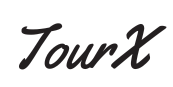

<a name="readme-top"></a>

<div align="center">
  <h2><b>🕹️🕹️ Tour Reservation App 🕹️🕹️</b></h2>
  <br/>
  
</div>
<br/>

# 📗 Table of Contents

- [📖 About the Project](#about-project)
  - [:camera: project screenshot](#screen-shoot)
  - [🛠 Built With](#built-with)
    - [Tech Stack](#tech-stack)
    - [Key Features](#key-features)
  - [🚀 Live Demo](#live-demo)
  - [🚀 Kaban Board](#Kaban-Board)
    - [Kaban Board Initial State](#initial-state)
  - [🚀 Project Screenshot](#project-screenshot)
- [💻 Getting Started](#getting-started)
  - [Setup](#setup)
  - [Prerequisites](#prerequisites)
  - [Install](#install)
  - [Usage](#usage)
- [👥 Authors](#authors)
- [🔭 Future Features](#future-features)
- [🤝 Contributing](#contributing)
- [⭐️ Show your support](#support)
- [🙏 Acknowledgements](#acknowledgements)
- [📝 License](#license)

# 🚀 Tour Reservation <a name="about-project"></a>

<p> A tour reservation app is a software application designed to facilitate the process of booking and managing tour reservations. It allows users to browse available tours, select desired tour packages, specify booking details and receive confirmation for their reservations.</p>


## Backend

The backend was made with ruby on rails and can be found [here](https://github.com/Johnadibe/tour-reservation-app-api)


## 🛠 Built With <a name="built-with"> </a>

-  HTML 5 , css3, javascript ES6, React , Redux and external API

### Tech Stack <a name="tech-stack"></a>

-  React, redux, axios, jest webpack and babel

### Key Features <a name="key-features"></a>

 <li>U User Registration and Authentication</li>
  <li>Tour Listings and Search</li>
  <li>Booking and Reservation Management</li>
  <li>Secure Payment Processing</li>
  
<p align="right">(<a href="#readme-top">back to top</a>)</p>

<!-- LIVE DEMO -->

## 🚀 Live Demo <a name="live-demo"></a>

- It will updated when available

<p align="right">(<a href="#readme-top">back to top</a>)</p>

## 🚀 Kaban Board <a name="Kaban-Board"></a>
- [Kaban Board](https://github.com/users/Johnadibe/projects/4) This is the link to the project management tool used to track the progress of the project.

### Kaban Board Initial State <a name="initial-state"></a>
- [Kaban Board Initial State](https://github.com/Johnadibe/tour-reservation-app-api/issues/23) This is the link to the project management tool used to track the progress of the project.

In this team, we are 4 in number,

- @Johnadibe
- @mrprotocoll
- @Hassaanjbaig-code
- @Donmark2k

<p align="right">(<a href="#readme-top">back to top</a>)</p>


<!-- PROJECT SCREENSHOTS -->

## 🚀 Project Screenshot <a name="project-screenshot"></a>


<p align="right">(<a href="#readme-top">back to top</a>)</p>

## 💻 Getting Started <a name="getting-started"></a>

To run on your localhost clone the project to local folder


### Prerequisites

In order to run this project you need:
- [git](https://git-scm.com/downloads): A tool for managing source code
- [Visual Studio Code](https://code.visualstudio.com/): A source code editor
- Have a working and updated browser
- Have a local version control like git installed on your computer
- A copy of the link of this Repository.
```sh
 https://github.com/Johnadibe/tour-reservation.git
```

### Setup
Clone this repository to your desired directory using the command: 

```sh
  cd your-folder
  git clone https://github.com/Johnadibe/tour-reservation.git 
```

### Install

Install the required dependencies using the following command:

```sh
  npm install
```
### Usage
Run the server using the following command:

```sh
  npm start
```

### Run tests
Run this command to run test
```sh
  npm test
```

## 👥 Authors <a name="authors"></a>

👤 **Chukwuemeka Ochuba**

- GitHub: [@Donmark2k](https://github.com/Donmark2k)
- Twitter: [@donmark2k](https://twitter.com/donmark2k)
- LinkedIn: [LinkedIn](https://www.linkedin.com/in/chukwuemeka-ochuba/)

👤 **mrprotocoll**
- GitHub: [@mrprotocoll](https://github.com/mrprotocoll)
- Twitter: [@dprotocoll](https://twitter.com/dprotocoll)
- LinkedIn: [@mrprotocoll](https://www.linkedin.com/in/mrprotocoll)

👤 **Hassaan Baig**
- GitHub: [@Hassaan Baig](https://github.com/Hassaanjbaig-code/)
- LinkedIn: [Hassaan Baig](https://linkedin.com/in/hassaan-jawwad=baig)

👤 **John Adibe**
- GitHub: [@Johnadibe](https://github.com/Johnadibe)
- Twitter: [@JohnAdibe2](https://twitter.com/JohnAdibe2)
- LinkedIn: [@John Adibe](https://www.linkedin.com/in/john-adibe/)

## 🔭 Future Features <a name="future-features"></a>
- Add admin dashboard
- Add payment portal

## 🤝 Contributing <a name="contributing"></a>

Contributions, issues, and feature requests are welcome!

Feel free to check the [issues page](https://github.com/Johnadibe/tour-reservation/issues).

<p align="right">(<a href="#readme-top">back to top</a>)</p>

## ⭐️ Show your support <a name="support"></a>

- Give a ⭐️ if you like this project!

<p align="right">(<a href="#readme-top">back to top</a>)</p>

## 🙏 Acknowledgments <a name="acknowledgements"></a>

We would like to appreciate [Microverse](https://www.microverse.org/) for providing the resources and the platform for us to be a Professional full-stack developer, and We would specially thank   [Murat Korkmaz](https://www.behance.net/muratk) who is the original author of this [design](https://www.behance.net/gallery/26425031/Vespa-Responsive-Redesign)
<p align="right">(<a href="#readme-top">back to top</a>)</p>

## 📝 License <a name="license"></a>

This project is [MIT](./LICENSE) licensed.

<p align="right">(<a href="#readme-top">back to top</a>)</p>
